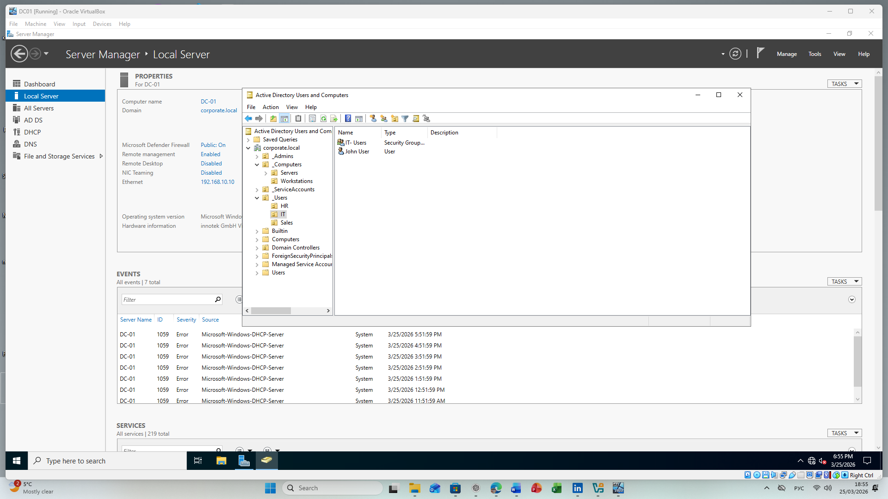
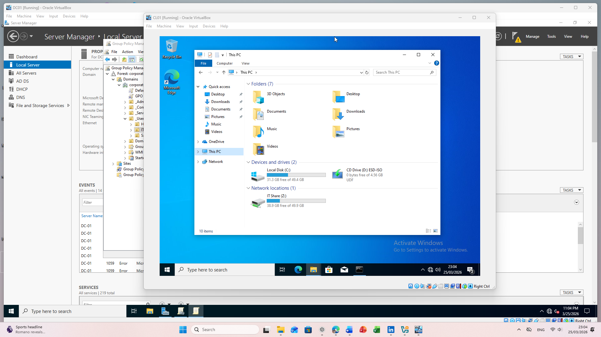
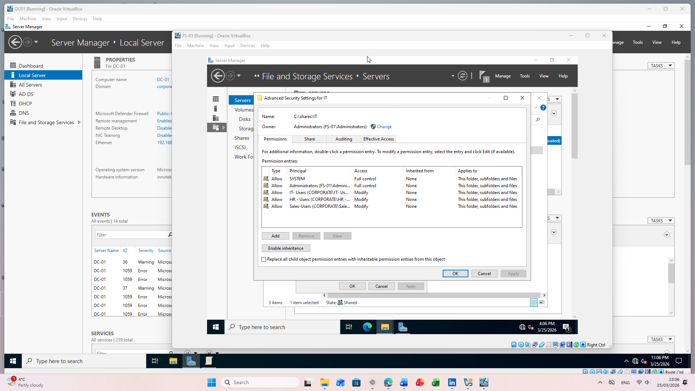
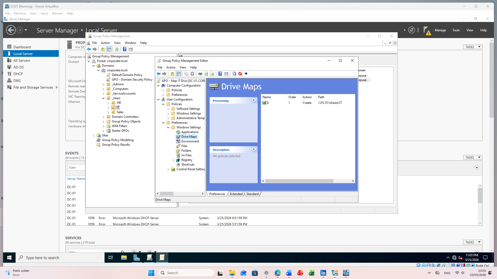

#  Active Directory Home Lab

##  Overview

This project demonstrates a complete Active Directory environment built using VirtualBox, including domain controller, file server, and client machine.

---

##  Lab Architecture

* **DC01** – Domain Controller (Active Directory, DNS)
* **FS01** – File Server (Shares + NTFS Permissions)
* **CL01** – Client Machine (Domain Joined)

---

##  Features Implemented

* Active Directory Domain Services (AD DS)
* DNS configuration and domain resolution
* Organizational Units (IT, HR, Sales)
* User and Group management
* NTFS and Share permissions
* File Server deployment
* Group Policy (GPO) configuration
* Drive mapping automation (Z:)

---

##  File Server Structure

\\FS01\Shares

* IT
* HR
* Sales

---

##  GPO Configuration

* Drive Mapping:

  * Path: `\\\\FS01\\Shares\\IT`
  * Drive Letter: `Z:`
* Applied to: IT Users (OU-based targeting)

---

##  Result

* IT users automatically receive mapped drive (Z:)
* Access controlled via security groups
* Centralized authentication through Active Directory

---

##  Screenshots

### Active Directory Users

### File Server Shares

### NTFS Permissions

### GPO Drive Mapping

### Mapped Drive (Client)

---

##  Skills Demonstrated

* Windows Server Administration
* Active Directory Management
* Group Policy Configuration
* File Server & Permissions
* Troubleshooting (DNS, authentication, access issues)

---

##  Outcome

Built and configured a fully functional enterprise-style Windows domain environment with centralized management and automated resource access.
